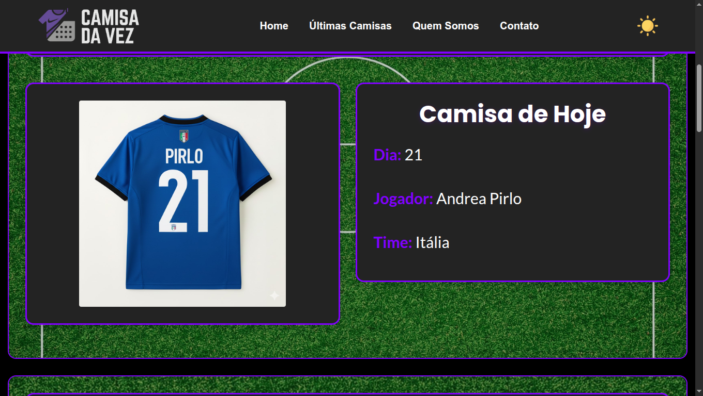

👕 Camisa da Vez

O Camisa da Vez é um projeto que une futebol e tecnologia de um jeito criativo: a cada dia do mês, o site destaca um jogador que utilizou aquela numeração específica. Se hoje é dia 21, o sistema busca automaticamente no banco de dados um atleta histórico com a camisa 21.

🚀 O que aprendi com este projeto
Este foi um dos meus maiores desafios técnicos iniciais. Nele, coloquei em prática:

Lógica de Programação: Usei PHP e MySQL para fazer o sistema "entender" a data atual e exibir o conteúdo correto.

Resolução de Problemas: Tive dificuldades para fazer o botão de Dark/Light Mode funcionar, o que me forçou a estudar manipulação de DOM com JavaScript até resolver.

Adaptabilidade: Após um feedback do meu professor sobre responsividade, refatorei o código para que o site ficasse perfeito também no celular.

🛠 Tecnologias
Linguagens: PHP e JavaScript.

Banco de Dados: MySQL.

Estilização: HTML5, CSS3 e Bootstrap.

Hospedagem: InfinityFree
